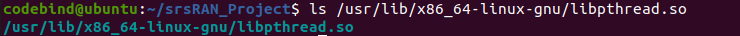
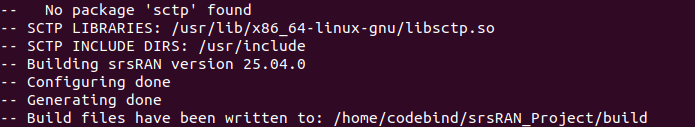

**ref :** https://docs.srsran.com/projects/project/en/latest/tutorials/source/near-rt-ric/source/index.html

install git & docker
```
sudo apt install -y git net-tools putty

# https://docs.docker.com/engine/install/ubuntu/
sudo apt update
sudo apt install -y ca-certificates curl
sudo install -m 0755 -d /etc/apt/keyrings
sudo curl -fsSL https://download.docker.com/linux/ubuntu/gpg -o /etc/apt/keyrings/docker.asc
sudo chmod a+r /etc/apt/keyrings/docker.asc
echo "deb [arch=$(dpkg --print-architecture) signed-by=/etc/apt/keyrings/docker.asc] https://download.docker.com/linux/ubuntu $(. /etc/os-release && echo "${UBUNTU_CODENAME:-$VERSION_CODENAME}") stable" | sudo tee /etc/apt/sources.list.d/docker.list > /dev/null
sudo apt update
sudo apt install -y docker-ce docker-ce-cli containerd.io docker-buildx-plugin docker-compose-plugin

# Add your username to the docker group, otherwise you will have to run in sudo mode.
sudo usermod -a -G docker $(whoami)
reboot
```
ORAN SC RIC deployment is performed as follows ( 需下載`i-release`版本 ) 
> p.s `i-release` 代表最早發行的版本

## Install sr-ric
(目前位置 : `~`)
```
git clone https://github.com/srsran/oran-sc-ric  
cd ./oran-sc-ric
docker compose up
```

```
docker compose ps
```

`????????????????`


在剛開始的`git clone https://github.com/srsran/oran-sc-ric  `
可以用git log 找到想要的 commit / 查看之間版本
```
git tag
```
會看到類似這樣的輸出
```
commit 1234abcd5678ef90...    ← 這是 commit hash（你只需要前7碼）
Author: ...
Date: ...
Message: 修正 E2 接口的錯誤
```
切換（checkout）到該 commit
```
git checkout -b my-feature-branch <commit-hash>
```

<commit-hash> : 772f910

## ZeroMQ
(目前位置 : `~`)
On Ubuntu, ZeroMQ development libraries can be installed with:
```
sudo apt-get install libzmq3-dev
```
Finally, you need to compile srsRAN Project and srsRAN 4G (assuming you have already installed all the required dependencies).

## srsRAN Project
(目前位置 : `~`)
For srsRAN Project, the following commands can be used to download and build from source:
```
git clone https://github.com/srsran/srsRAN_Project.git
cd srsRAN_Project
mkdir build
cd build
cmake ../ -DENABLE_EXPORT=ON -DENABLE_ZEROMQ=ON # 通常在你想要用 srsRAN 串接 xApp 或做模擬外部監控時才會開
make -j$(nproc)
```
> [!Warning]
> Could NOT find MbedTLS (missing: MBEDTLS_LIBRARIES MBEDTLS_INCLUDE_DIRS)
**solution** : 安裝 MbedTLS 套件
```
sudo apt update
sudo apt install libmbedtls-dev
```

open `CMakeError.log`
**problem :**
1. log
```
/usr/bin/ld: cannot find -lpthreads
```
pthread（POSIX threads）函式庫未正確連結。這個錯誤是由某些舊版 CMake 模組誤用 `-lpthreads` 導致的。Linux 上的 pthread 是單一庫：`libpthread.so`。\
**solution :** install `pthreads`
```
sudo apt update
sudo apt install build-essential
```
The commands above also install the tools :
gcc, g++, make, libc6-dev（其中就有 pthread）

檢查是否存在 `libpthread.so`
```
ls /usr/lib/x86_64-linux-gnu/libpthread.so
```

確認存在。

清除舊的 build 暫存資料
```
cd ~/srsRAN_Project
rm -rf build
mkdir build
cd build
cmake .. -DENABLE_EXPORT=ON -DENABLE_ZEROMQ=ON
```

> [!Warning]
> 再次顯示出 pthread 測試連結失敗
```
/usr/bin/ld: cannot find -lpthreads
```
**solution** : 手動強制連結正確的 pthread 函式庫\
在 cmake 時明確指定 pthread 函式庫，行以下指令來重建 build 資料夾並加入正確的 pthread 連結方式
```
cd ~/srsRAN_Project
rm -rf build
mkdir build
cd build
cmake .. -DCMAKE_THREAD_LIBS_INIT="-lpthread" -DCMAKE_HAVE_THREADS_LIBRARY=1 -DCMAKE_USE_WIN32_THREADS_INIT=0 -DCMAKE_USE_PTHREADS_INIT=1 -DENABLE_EXPORT=ON -DENABLE_ZEROMQ=ON
```
| CMake 參數                           | 說明                           |
| ---------------------------------- | ---------------------------- |
| `-DCMAKE_THREAD_LIBS_INIT`         | 明確指定連結 `-lpthread`           |
| `-DCMAKE_HAVE_THREADS_LIBRARY=1`   | 告訴 CMake：我有 thread library   |
| `-DCMAKE_USE_PTHREADS_INIT=1`      | 使用 POSIX thread（pthread）     |
| `-DCMAKE_USE_WIN32_THREADS_INIT=0` | 禁用 Windows thread（你是用 Linux） |


> [!Warning]
> 仍然缺少 DFT (傅立葉轉換) 函式庫。srsRAN 需要這個來進行物理層訊號處理。
**安裝 FFTW3F（單精度版）**
```
sudo apt update
sudo apt install libfftw3-dev libfftw3-single3
```
| 套件名稱               | 用途                      |
| ------------------ | ----------------------- |
| `libfftw3-dev`     | FFTW 的開發檔（含 header 檔案）  |
| `libfftw3-single3` | FFTW 的單精度版（srsRAN 使用這個） |

然後重新跑 CMake
```
cd ~/srsRAN_Project/build
cmake .. -DCMAKE_THREAD_LIBS_INIT="-lpthread" -DCMAKE_HAVE_THREADS_LIBRARY=1 -DCMAKE_USE_WIN32_THREADS_INIT=0 -DCMAKE_USE_PTHREADS_INIT=1 -DENABLE_EXPORT=ON -DENABLE_ZEROMQ=ON
```

> [!Warning]
> 缺少SCTP 套件




p.s \
**`cmake ../` 和 `cd ..`** 的差別
前者可以不離開當前目錄僅打開檔案\
**EX :**
```
cmake ../ -DENABLE_EXPORT=ON -DENABLE_ZEROMQ=ON
```


p.s \
**基本linux指令(建造目錄.返回目錄.建造檔案.離開檔案)**
* 建立目錄（資料夾） 。建立一個名為 `my_folder` 的資料夾
```
mkdir my_folder
```
* 進入目錄(資料夾)
```
cd my_folder
```
* 返回上一層目錄\
例如從 `/home/user/my_folder` 回到 `/home/user`
```
cd ..
```
* 使用 nano 直接編輯（若不存在則會自動建立）
```
nano my_file.txt
```
* Others
| 指令                 | 功能             |
| ------------------ | -------------- |
| `ls`               | 列出目前目錄下的檔案與資料夾 |
| `pwd`              | 顯示你目前所在的完整路徑   |
| `rm my_file.txt`   | 刪除檔案           |
| `rm -r my_folder`  | 刪除資料夾（包含裡面內容）  |
| `cp a.txt b.txt`   | 複製檔案           |
| `mv a.txt folder/` | 移動檔案或重新命名      |


## `make -j$(nproc)`
| 部分|說明|
| ------------ | ----------------------------------------- |
| `make`       | 根據 `Makefile` 編譯原碼，執行建置系統              |
| `-j`         | 指定「同時可以啟動幾個編譯工作（jobs）」來加速。                |
| `$(nproc)`   | Linux 指令，回傳 **CPU 核心數**（例如 4、8、16）。       |
| `-j$(nproc)` | 結果會像 `-j8` 或 `-j4`，表示一次啟動 8 或 4 個工作來平行處理。 |
